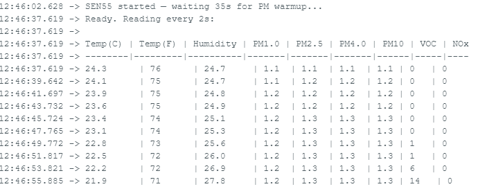

# Air-Pollution-Monitor
# SEN55 Serial Monitor Test — Arduino Leonardo / Pro Micro / ESP32-S3

A minimal diagnostic sketch for the **Sensirion SEN55** environmental sensor, designed to verify sensor health and baseline readings via the Arduino Serial Monitor. No WiFi, no web server — just clean tabular output to confirm everything is working before integrating into a larger project.

---

## What It Does

- Initialises the SEN55 over I2C
- Waits 35 seconds for the PM laser to warm up
- Prints all 8 sensor values to Serial Monitor every 2 seconds in a formatted table:

## Hardware

| Board | Status |
|-------|--------|
| Arduino Leonardo | ✅ Tested |
| SparkFun Pro Micro (5V/16MHz) | ✅ Tested |
| ESP32-S3| ✅ Tested |

**Why 5V boards?** The SEN55 requires 5V power for its fan and laser. On a 5V board the I2C lines run at 5V natively, so no level shifter is needed. Powering the SEN55 from a 3.3V microcontroller (e.g. ESP32) requires a bidirectional I2C level shifter (e.g. BSS138-based) to avoid corrupted readings.

---

## Wiring

| SEN55 Pin | Colour | Connect To |
|-----------|--------|------------|
| VDD | Red | 5V |
| GND | Black | GND |
| SDA | Green | SDA (pin 2) |
| SCL | Yellow | SCL (pin 3) |
| SEL | Blue | GND ← required for I2C mode |
| NC | Purple | Not connected |

> **SEL must be connected to GND.** Leaving it floating causes the sensor to default to a different interface and will result in read errors.

---

## Dependencies

Install via Arduino Library Manager:

- **Sensirion I2C SEN5X** by Sensirion (`SensirionI2CSen5x`)

---

## Setup

1. Install the library above
2. Wire the sensor as shown
3. In Arduino IDE select **Tools → Board → Arduino Leonardo** (works for both Leonardo and Pro Micro; for Pro Micro you can also use SparkFun's board package and select *Pro Micro 5V/16MHz*)
4. Upload the sketch
5. Open Serial Monitor at **115200 baud**
6. Wait ~35 seconds for the PM warmup message, then readings begin

---

## Expected Output

In clean indoor air you should see:

- **PM1.0 / PM2.5 / PM4.0 / PM10** — typically 1–5 µg/m³ (WHO annual guideline for PM2.5 is 5 µg/m³)
- **VOC index** — starts at 0 and climbs over the first few minutes as the algorithm initialises; needs ~1 hour to fully stabilise its baseline
- **NOx index** — 1 in clean indoor air, higher near combustion sources
- **Temperature** — may drop several degrees in the first minute as the STAR engine compensates for sensor self-heating

Values in the thousands indicate a wiring or voltage problem, not real air quality.

---

## Part of

This sketch is a hardware validation tool for a larger **SEN55 WiFi Air Monitor** project running on ESP32-S3, serving a live web dashboard with charts and per-metric explanations. See the main project for the full modular ESP-IDF firmware.
